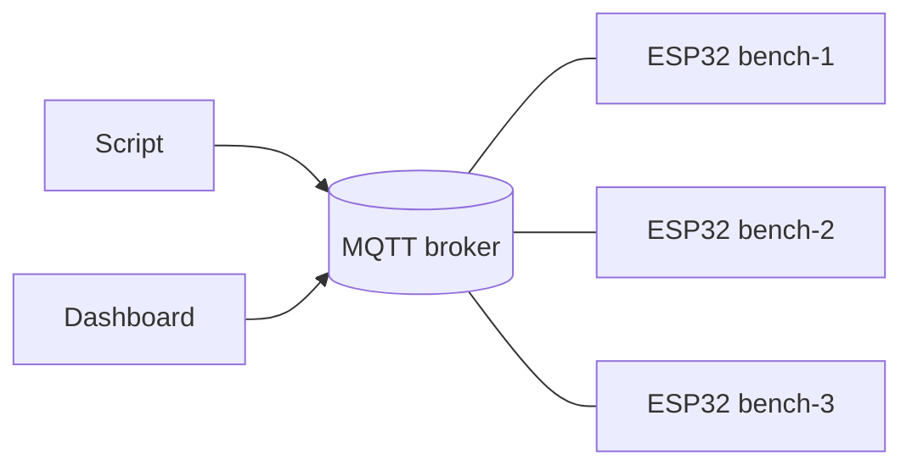

# espswarm

[](https://github.com/arshnooramin/espswarm/actions/workflows/python.yml)

Control a fleet of ESP32 boards from Python through an MQTT broker.



## Why

Libraries like [telemetrix-esp32](https://github.com/MrYsLab/telemetrix-esp32)
control one board over a direct connection. espswarm puts a broker in the
middle instead:

- **Many boards, one connection.** Boards dial out to the broker, so they can be
  anywhere they can reach it, including behind NAT. No board IP addresses.
- **Many clients.** Scripts, notebooks and dashboards can use the same boards.
- **Discovery and presence.** Boards announce themselves; offline boards are
  reported by the broker.
- **Broker security.** Use your broker's TLS, accounts and ACLs instead of an
  open port per board.
- **Safe failures.** Boot sessions, duplicate suppression for retries, and
  explicit "outcome unknown" timeouts.

Intended for remote labs, hardware test benches and distributed prototypes.
Commands make a network round trip, so timing-critical work belongs on the
board. Requires Python 3.11+ and MicroPython 1.29.0. Not yet validated on
hardware.

## Usage

```python
from espswarm import Client

with Client("broker.lab") as client:
    # Report boards as they are discovered, go offline, or restart.
    client.on_status(lambda board, status: print(board.board_id, status.online))

    bench = client.board("bench-1")  # waits for the board's status
    bench.call("gpio.configure", {"pin": 2, "mode": "output"})
    bench.call("gpio.write", {"pin": 2, "level": 1})
```

`client.boards()` lists the boards discovered so far. Their statuses arrive
just after connecting, so use `client.board(id)` or `on_status` to wait for them.

| Exception | Meaning |
| --- | --- |
| `RequestTimeout` | No response in time; the operation may or may not have run |
| `BoardRestarted` | Board rebooted and lost pin configuration; reconfigure and continue |
| `BoardOffline` | The board is offline |
| `BrokerDisconnected` | This client lost the broker; it reconnects automatically |
| `BoardError` subclasses | Board rejected the request (`InvalidState`, `Busy`, …) |

All exceptions derive from `SwarmError`.

Calls are thread-safe. Callbacks run on a dedicated thread and may call boards.
See the [protocol](docs/protocol.md) for operations, timeouts and failure
handling, and the [board agent](firmware/README.md) for flashing.

## Layout

| Path | Contents |
| --- | --- |
| `src/espswarm/` | Host library: `Client`, `Board`, transport, protocol encoding, errors |
| `firmware/` | MicroPython board agent |
| `docs/protocol.md` | Protocol specification |
| `tests/` | `test_host_*` (library), `test_board_*` (firmware), MicroPython smoke test |

## Development

```sh
python -m venv .venv && source .venv/bin/activate
python -m pip install -e '.[dev]'
python -m pytest
ruff check . && black --check .
python -m build
```

Host tests run against the real firmware code with an in-process fake broker
(`tests/host_fakes.py`); no broker or board is needed.
