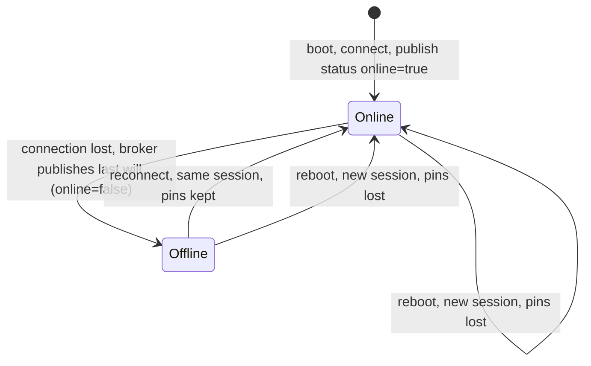
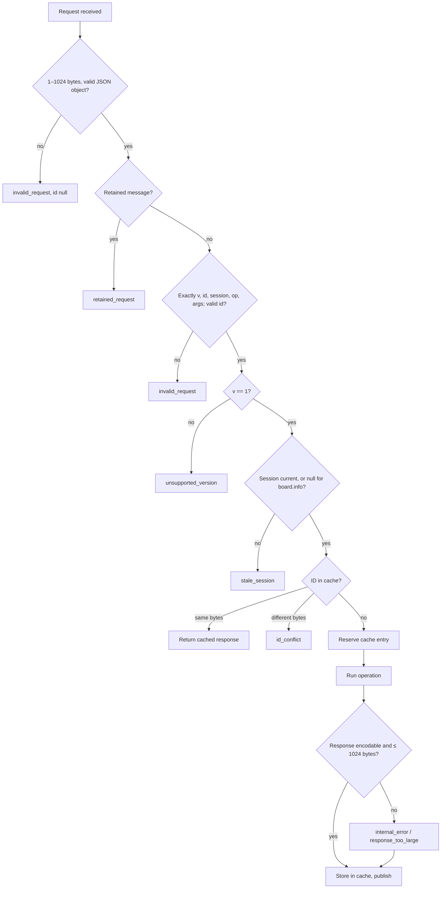
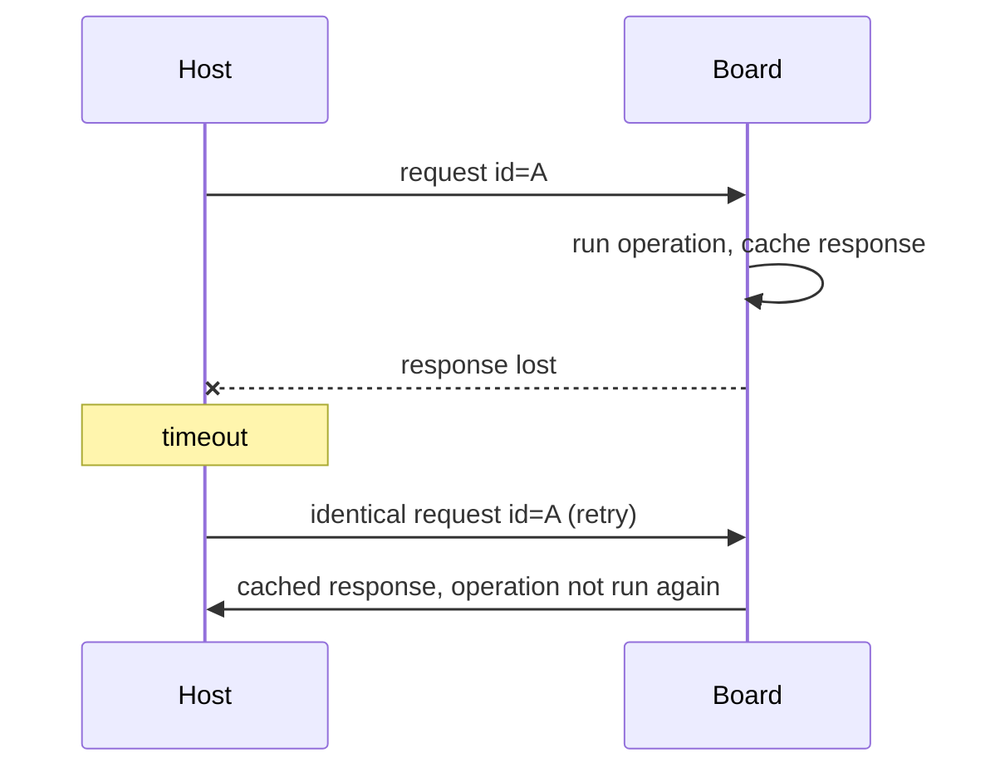

# MQTT protocol v1

The contract between the host library (`src/virtual_esp`) and the board agent
(`firmware/virtual_esp_board`). Both speak MQTT 3.1.1 through a broker; neither
talks to the other directly.


## Topics

All topics are `virtual-esp/v1/<board_id>/<suffix>`. `board_id` is 1–32 of
`[A-Za-z0-9_-]`; it defaults to the board's Wi-Fi MAC as 12 hex digits.

| Suffix | Publisher | QoS | Retained | Content |
| --- | --- | --- | --- | --- |
| `request` | Host | 1 | Never | Commands |
| `response` | Board | 1 | No | One per request |
| `status` | Board, or broker (last will) | 1 | Yes | Session and online flag |
| `events/gpio` | Board | 0 | No | Pin edges |

The response topic is shared by every client of a board. Clients tell their
responses apart by request ID. Restrict access with broker ACLs.

## Messages

All messages are UTF-8 JSON objects of at most 1024 bytes, carrying `"v": 1`
and the board's current `session`.

**Request.** Exactly these five keys:

```json
{"v":1,"id":"0f8c…","session":"a1b2c3d4e5f60718","op":"gpio.write","args":{"pin":2,"level":1}}
```

| Key | Rule |
| --- | --- |
| `id` | 1–64 of `[A-Za-z0-9_-]`; unique per logical request (the host uses `uuid4().hex`) |
| `session` | The board's current session, or `null` for `board.info` only |
| `op` | Operation name, 1–48 characters |
| `args` | Object; exactly the operation's arguments, no extras |

The board's JSON decoder rejects duplicate keys, NaN and Infinity, NUL
characters, trailing data and nesting deeper than 8 levels. Numbers that should
be integers must be JSON integers; `true` is not `1`.

**Response.** `id` is `null` if the request was too malformed to read one.

```json
{"v":1,"id":"0f8c…","session":"a1b2c3d4e5f60718","ok":true,"result":{}}
{"v":1,"id":"0f8c…","session":"a1b2c3d4e5f60718","ok":false,"error":{"code":"invalid_state","message":"Configure pin as output first"}}
```

**Status.** Retained. The board publishes `"online": true` after connecting; the
broker publishes the identical message with `"online": false` as the last will.

```json
{"v":1,"session":"a1b2c3d4e5f60718","online":true,"board_id":"workbench","target":"esp32",
 "runtime":"micropython","capabilities":["gpio","gpio.events"],"max_payload":1024,"response_cache_size":8}
```

**Event.** See [GPIO events](#gpio-events).

```json
{"v":1,"session":"a1b2c3d4e5f60718","event":"gpio.edge","pin":5,"level":1,"sequence":42,"dropped":0}
```

## Operations

| Operation | Arguments | Result | Errors |
| --- | --- | --- | --- |
| `board.info` | none | Status fields without `online` | |
| `gpio.configure` | `pin`, `mode` (`input`/`output`); optional `pull` (`none`/`up`/`down`), `initial` (0/1, output only) | `{}` | `invalid_args`, `busy` if watched |
| `gpio.read` | `pin` | `{"level": 0 or 1}` | `invalid_state` unless input |
| `gpio.write` | `pin`, `level` | `{}` | `invalid_state` unless output |
| `gpio.watch` | `pin`, `edge` (`rising`/`falling`/`any`) | `{}` | `invalid_state` unless input, `busy` if watched |
| `gpio.unwatch` | `pin` | `{}` | |
| `gpio.reset` | `pin` | `{}`; stops watching, input without pull | |

Usable pins: 0, 2, 4, 5, 12–15, 18, 19, 21–23, 25–27, 32–39. Pins 34–39 are
input-only and have no pulls. Others are reserved for flash, console or PSRAM.

## Sessions

Each boot generates a random 16-hex-digit session. Pin configuration lives in
RAM, so a new session means all pins are unconfigured. A request carrying any
other session is rejected with `stale_session` before it reaches hardware, so
commands written for a previous boot can never run on the next one.



Hosts learn the session from the retained status (or `board.info` with
`"session": null`). The host library raises `BoardRestarted` on the first call
after the session changes, then uses the new session.

## Request handling

The board handles one request at a time, in arrival order. Checks run in this
order; the first failure produces the response.



Errors before the cache lookup are not cached; the request never touched
hardware. Everything from "Reserve" onward is cached, including failures.

### Error codes

| Code | Meaning | Cached | Host exception | What the client should do |
| --- | --- | --- | --- | --- |
| `invalid_request` | Malformed envelope or JSON | No | `InvalidRequest` | Fix the client |
| `retained_request` | Request was published retained | No | `BoardError` | Publish without retain |
| `unsupported_version` | `v` is not 1 | No | `BoardError` | Upgrade one side |
| `stale_session` | Session is not the current one | No | `BoardRestarted` | Re-read status, reconfigure pins |
| `id_conflict` | ID reused with different bytes | No | `BoardError` | Use a fresh ID |
| `invalid_args` | Missing, extra or invalid arguments | Yes | `InvalidArguments` | Fix the arguments |
| `invalid_state` | Pin not configured for this operation | Yes | `InvalidState` | Configure the pin first |
| `busy` | Pin is watched | Yes | `Busy` | `gpio.unwatch` first |
| `unsupported_operation` | Board lacks the operation | Yes | `UnsupportedOperation` | Check `capabilities` |
| `hardware_error` | Hardware raised `OSError` | Yes | `HardwareError` | Check wiring; may be transient |
| `internal_error` | Bug, or result not encodable | Yes | `BoardError` | Report it |
| `response_too_large` | Result exceeds 1024 bytes | Yes | `BoardError` | Request less data |
| `unknown_outcome` | Entry reserved but no response was built | Yes | `UnknownOutcome` | Check hardware state |

Error messages never include exception text, credentials or payloads.

## Retries and duplicate suppression

MQTT QoS 1 is at-least-once, and a client cannot tell a lost request from a lost
response. The board therefore keeps its last **8** responses, keyed by request
ID and the exact request bytes.



Rules for clients:

- Generate one ID per logical request. A blink loop sends a new ID per write.
- Retry by resending the **identical bytes**. Re-encoding may change them and
  get `id_conflict`.
- Suppression is bounded: after 8 newer requests (from any client) the entry is
  evicted and a retry runs again. Retry promptly, a few times at most.
- The host library does not retry by default, because a retry after eviction
  repeats the command. Pass `retries=` to opt in.

The cache is in RAM: it survives MQTT reconnects and is lost on reboot, which
also changes the session, so old requests are rejected anyway.

## Timeouts

| Where | What | Default | On expiry |
| --- | --- | --- | --- |
| Host `Board` | Wait for each response | 5 s (`timeout=`) | `RequestTimeout`: outcome unknown |
| Host `Board.connect` | Wait for retained status | 5 s | `BoardOffline` |
| Host transport | Broker CONNACK, each SUBACK | 10 s | `ConnectionFailed` |
| Host transport | Reconnect delay | 1 s doubling to 30 s | Retries forever, then resubscribes |
| Board | Wi-Fi association | 20 s (`wifi_timeout`) | Disconnect, back off, retry |
| Board | Each MQTT operation (CONNECT, SUBSCRIBE, PUBLISH+PUBACK, frame read), total | 5 s (`socket_timeout`) | Drop connection, back off, retry |
| Board | Keepalive: PINGREQ after idle | 15 s (`keepalive` / 2) | |
| Board | PINGRESP wait | 5 s (`socket_timeout`) | Drop connection |
| Broker | No packet from board | 45 s (1.5 × `keepalive`) | Publish last will: `online=false` |
| Board | Reconnect backoff | 1 s doubling to 30 s; reset after 30 s connected | |

DNS resolution and NTP run outside the 5 s operation deadline.

## Failure handling

| Failure | Board | Host library |
| --- | --- | --- |
| Request lost | Never sees it | `RequestTimeout`; a retry runs it once |
| Response lost | Ran and cached it | `RequestTimeout`; a retry returns the cached response |
| Board offline (last will received) | Reconnecting | Waiting calls fail at once with `BoardOffline`; new calls too |
| Board reboots mid-request | New session, pins reset | Waiting calls fail with `BoardRestarted` when the new status arrives |
| Board reboots, status not yet seen | Rejects with `stale_session` | `BoardRestarted` |
| Host loses broker | Unaffected | paho reconnects and resubscribes; calls in flight time out, new calls raise `BoardOffline` until reconnected |
| Wi-Fi lost on board | Closes MQTT, backs off, reconnects | Sees last will, then online status with the same session |
| Malformed or oversized MQTT frame | Drops the connection | As board offline |
| More than 4 requests arrive while the board waits for a PUBACK | Drops the connection; queued requests are discarded | Their calls time out |
| Unexpected exception in the agent | Logs, waits 10 s, resets | As board reboot |

### Board reconnect sequence

```mermaid
sequenceDiagram
    participant B as Board
    participant M as Broker
    B->>B: connect Wi-Fi (≤ 20 s); NTP sync if TLS
    B->>M: CONNECT clean session, last will = status online=false (retained, QoS 1)
    M->>B: CONNACK
    B->>M: SUBSCRIBE request (QoS 1)
    M->>B: SUBACK
    B->>B: clear events queued while offline
    B->>M: PUBLISH status online=true (retained, QoS 1)
    loop until Wi-Fi or MQTT fails
        B->>M: responses, events, PINGREQ
    end
    B->>B: close, wait backoff, start again
```

Online status is published only after SUBACK, so a host that sees
`online=true` can send immediately. Clean sessions mean requests published
while the board is offline are not delivered later; they time out.

## GPIO events


- The IRQ handler only writes two bytes into a preallocated buffer; it never
  allocates or touches the network.
- `level` is read inside the IRQ, after the edge, so fast pulses can report the
  same level twice.
- `dropped` counts edges lost to a full buffer since the previous event,
  saturating at 65535. They have no `sequence`.
- `sequence` increments per published event and wraps at 2³⁰. A gap means
  events were lost after leaving the buffer (QoS 0 or network).
- Events queued while offline are discarded on reconnect and are not counted.
- Events already queued before `gpio.unwatch` may still arrive.

Events are for observation. Precise timing or reliable pulse counting must be
done on the board.

## Board transport limits

The board's MQTT client allows one outstanding acknowledgment. Requests that
arrive while it waits for a PUBACK are queued (at most 4). Packets larger than
1280 bytes, topics longer than 128 bytes, and QoS 2 are rejected by dropping the
connection. TLS verifies the broker certificate and hostname against the
configured CA; NTP sets the clock before each TLS connection.
