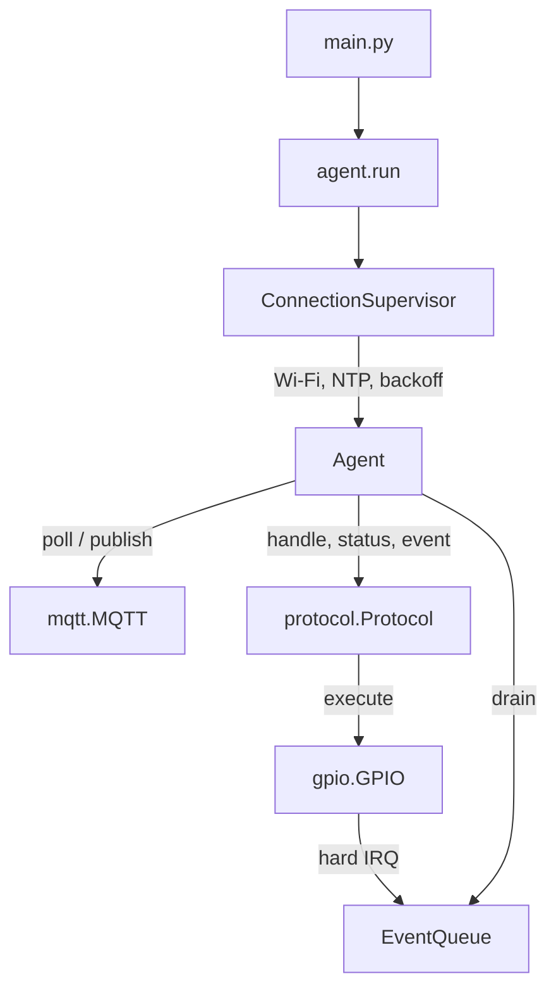

# Board agent

MicroPython 1.29.0 agent for a classic ESP32 DevKit. It connects to an existing
MQTT broker and serves the [protocol](../docs/protocol.md). Not yet validated
on hardware.

## Flash and deploy

```sh
python -m pip install '.[board]'
esptool --chip esp32 --port PORT erase-flash
esptool --chip esp32 --port PORT write-flash 0x1000 ESP32_GENERIC-v1.29.0.bin
```

Use the [generic firmware](https://micropython.org/download/ESP32_GENERIC/) for
WROOM boards, the SPIRAM variant for WROVER. `PORT` is e.g.
`/dev/cu.usbserial-…` or `COM4`.

```sh
cp firmware/config.example.json firmware/config.json   # edit; Git ignores it
mpremote connect PORT mip install logging@0.6.2
mpremote connect PORT fs cp -r firmware/espswarm_agent :
mpremote connect PORT fs cp firmware/config.json :config.json
mpremote connect PORT fs cp firmware/main.py :main.py
mpremote connect PORT reset
mpremote connect PORT repl                              # view logs
```

## Configuration

`config.json` is strict JSON, validated at boot. Invalid config stops boot with
a traceback on the console.

| Key | Default | Notes |
| --- | --- | --- |
| `wifi_ssid` | required | ≤ 32 bytes |
| `wifi_password` | `""` | ≤ 63 bytes |
| `mqtt_host` | required | |
| `mqtt_port` | `1883` | Usually 8883 with TLS |
| `mqtt_username`, `mqtt_password` | `null` | Password requires username |
| `mqtt_tls` | `false` | Verifies certificate and hostname |
| `mqtt_ca_file` | `broker-ca.pem` | PEM CA, uploaded to the board |
| `ntp_host` | `pool.ntp.org` | Clock sync before TLS |
| `board_id` | `null` | Unique per broker. Set a readable name (`bench-1`) for fleets; the default is the Wi-Fi MAC |
| `wifi_timeout` | `20` | Seconds, 1–120 |
| `socket_timeout` | `5` | Seconds, 1–30; deadline per MQTT operation |
| `keepalive` | `30` | Seconds, 10–300 |

## Internals



| Module | Role |
| --- | --- |
| `agent.py` | `ConnectionSupervisor` keeps Wi-Fi and MQTT up; `Agent` loop: poll one message, respond, drain ≤ 16 events |
| `protocol.py` | Validation, `ResponseCache`, routing to peripherals, message encoding |
| `peripheral.py` | `Peripheral` base: `capabilities`, an `operations` table, argument checks |
| `gpio.py` | `GPIO` peripheral and the IRQ-safe `EventQueue` |
| `mqtt.py` | Minimal MQTT 3.1.1 client: QoS 0/1, bounded buffers, deadlines |
| `settings.py` | `config.json` schema (`FIELDS`) |
| `json_codec.py` | Strict JSON decoder for requests and config |

Everything runs in one thread. IRQ handlers only enqueue. Unexpected exceptions
are logged and the board resets after 10 s. Credentials and payloads are never
logged.

### Adding a peripheral

Subclass `Peripheral`, declare `capabilities` and `operations`, and pass an
instance to `Protocol` in `agent.run()`. Methods raise `CommandError` for client
errors and return a JSON-serializable dict.

```python
class ADC(Peripheral):
    capabilities = ("adc",)
    operations = {"adc.read": ("read", ("pin",), ())}  # method, required, optional

    def read(self, pin):
        ...
        return {"value": raw}
```

Peripherals do not yet coordinate pin ownership.

## Testing

```sh
python -m pytest tests/test_board_*.py
micropython tests/micropython_smoke.py    # from the repo root; CI does this
```

CPython tests use the fakes in `tests/board_fakes.py`. The smoke test checks
MicroPython compatibility, including that the IRQ path does not allocate.
